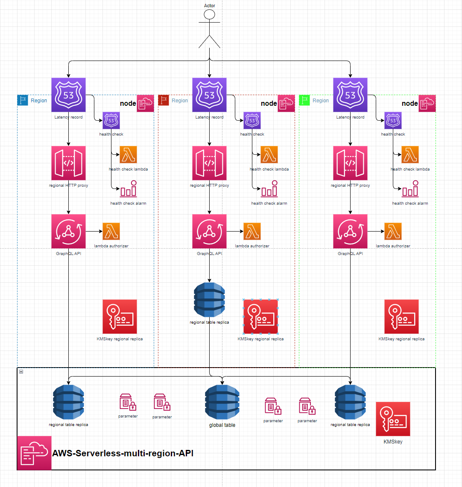

# AWS-Serverless-Multi-Region-API

This is a proof of concept global AWS API using the Serverless framwork.
It includes a base `api` stack made up of a global dynamo table & it's replicas, A KMS key and many SSM parameters to pass relevant Ids & Arns to the `node` stacks.

The `node` stacks create a GraphQL API with a HTTP Proxy fronted by a Latency Route53 record with Cloudwatch metric or Lambda health checks for regional failover. The `node` stacks are designed to be region agnostic and can be deployed into any region that already has a global table replica in. The GraphQL API communicates with the replica in its own region to provide the lowest possible latency to access data across the globe.

The base `api` stack also includes a KMS key that's replicated in each `node` stack. The intention of this was to be used by the Lambda Authorizer for the region specific GraphQL API to authorize encrypted credentials stored in the global table as a 'global' authentication mechanism. This was preferable compared to AWS managed regional API keys (would fail if requests were routed to the region that the key wasn't created in) or cognito authorization which are inherently non-global

